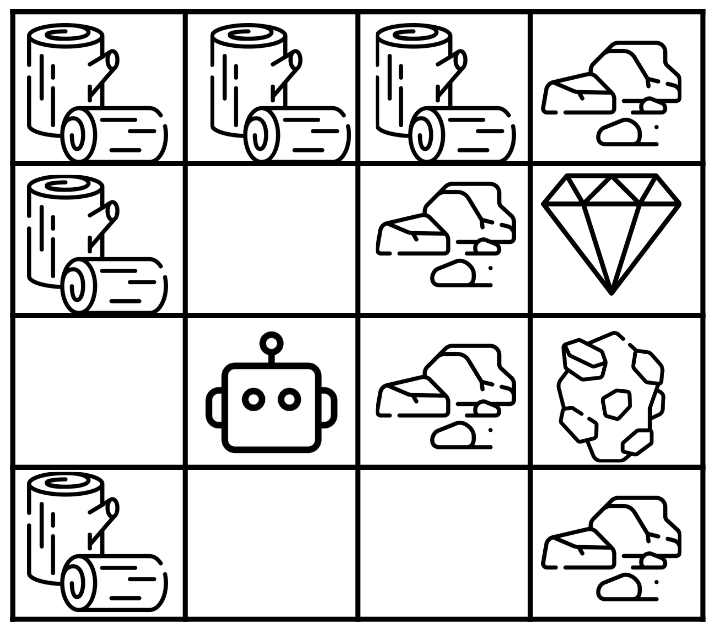
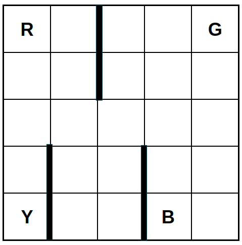
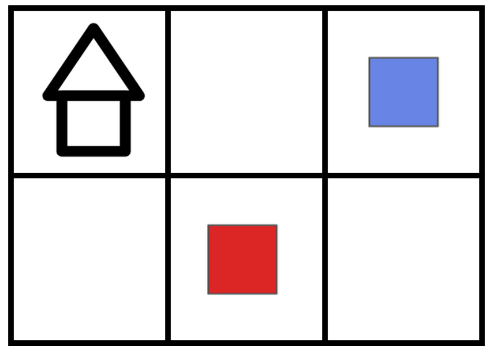

# RL-Environments

A collection of simple reinforcement learning environments.
Some are modifications of other environments, others are based on tabletop games,
and some are entirely unique.

## Environments Implemented

**Lavaflow**

Inspired by an environment created by [Mohamed and Jimenez Rezende (2015)](https://arxiv.org/abs/1509.08731).


**Simple Crafter**

A more simple and refined version of the [Crafter environment](https://danijar.com/project/crafter/) (Hafner 2021).



**Taxicab**



**Tinytown**

Based on the board game [Tiny Towns](https://www.petermcpherson.com/games/tiny-towns) by Peter McPherson.



## Usage

The environments follow (roughly) the same structure as [OpenAI Gym](https://github.com/openai/gym).
Each environment has a 1 `step` and `reset` method:

```python
def step(action) -> (np.ndarray, float, bool, Any)
```
```python
def reset() -> (np.ndarray, any)
```

Thus an agent-environment loop can be written as:

```python
done = False
state, _ = environment.reset()

while not done:
    action = agent.choose_action(state)
    next_state, rewad, done, _, _ = environment.step(action)
    agent.learn(state, action, reward, next_state, done)
    state = next_state
```

### Creating State Transition Graph

Environments are created such that networks of their states and transitions between each state can be made.
Such graphs are called _state transition graphs_:

```python
def get_adjacency_matrix(
        self,
        directed: bool=True,
        probability_weights: bool=False,
        compressed_matrix: bool=False,
        progress_bar: bool=False
) -> (np.ndarray|sparse.csr_matrix, mx.DiGraph, Dict[str, Dict[str, str]])
```
This method returns an adjacency matrix, a state transition graph, and a dictionary
where each key is a node that points to the state it represents.

For large environments, the method can return the adjacency matrix as a Scipy Sparse array,
stored in compressed sparse row format.

To achieve this for any environment, each environment has a `get_successor_states` method.
This method returns all potentially successor states for a given state.
Creating such a function is all that is required to attain a complete state transition graph:

```python
def get_successor_states(
            self,
            state: np.ndarray,
            probability_weights: bool=False
    ) -> (List[np.ndarray], List[float])
```

## License

[MIT](https://choosealicense.com/licenses/mit/)
