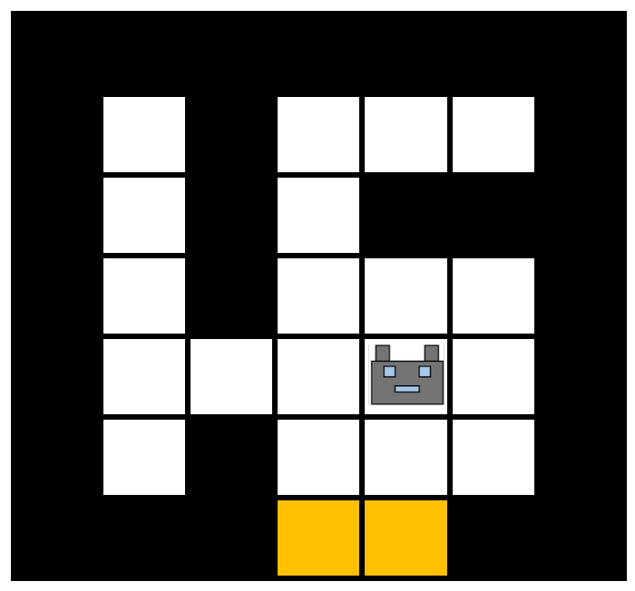

# Lavaflow Environment

A 2D gridworld environment consisting of an $n \times n$ maze.
Lava spreads to adjacent squares each timestep. The agent needs to place blocks in order to protect the
largest amount of area from lava.

Inspired by an environment created by [Mohamed and Jimenez Rezende (2015)](https://arxiv.org/abs/1509.08731).

| Parameter        | Type                                        | Description                                                                     |
|------------------|---------------------------------------------|---------------------------------------------------------------------------------|
| Grid Size: $n$   | $\mathbb{N}$                                | Width/height of the maze.                                                       |
| Maze Layout: $M$ | ${\left\lbrace0, 1, 2, 3\right\rbrace}^{2}$ | The initial layout of the maze,  describes where the blocks and lava start. |

| Property                | Value | Upper Bound                                                                                                         |
|-------------------------|-------|---------------------------------------------------------------------------------------------------------------------|
| $\vert\mathcal{S}\vert$ | ~     | $2\left(3^{\left(k - 1\right)} + k\right)$  Where $k$ is the number of empty squares in the initial grid layout |
| $\vert\mathcal{A}\vert$ | $9$   | ~                                                                                                                   |

| Feature                            | Value     |
|------------------------------------|-----------|
| Deterministic                      | Yes       |
| Directed                           | Partially |
| Continual                          | No        |
| All Actions Possible in all States | Yes       |

## State Space

**Type:** Matrix of size $n + 1$ by $n + 1$, with values from $\left\lbrace0, 1, 2, 3\right\rbrace$.
More formally: ${\left\lbrace0, 1, 2, 3, 4\right\rbrace}^{n + 1 \times n + 1}$.

**Upper Bound:** $2\left(3^{\left(k - 1\right)} + k\right)$.
 Where $k$ is the number of empty squares in the initial grid layout.

A state is a matrix where the $(i + 1, j + 1)$ index shows the value of the $(i, j)$ square in the grid.
Whether the square is empty, a block, lava, or holds the agent. The $(0, 0)$ entry shows a $1$ if the state is terminal and a $0$ otherwise

## Action Space

**Type:** $\mathbb{N}$.

| Action           | Description                                            |
|------------------|--------------------------------------------------------|
| North: $0$       | Move up one square.                                    |
| South: $1$       | Move down one square.                                  |
| East: $2$        | Move right one square.                                 |
| West: $3$        | Move left one square.                                  |
| North Block: $4$ | Place a block in the square above the agent.           |
| South Block: $5$ | Place a block in the square above the agent.           |
| East Block: $6$  | Place a block in the square right of the agent.        |
| West Block: $7$  | Place a block in the square left of the agent.         |
| Terminate: $8$   | Terminate the environment and end the current episode. |

Placing block actions ($4, 5, 6, 7$) have no effect if the square already contains a block

## Transition Dynamics
The agent starts in a random empty square in the initial maze layout.
Each timestep, every lava spreads from every square containing lava to each adjacent square not containing a block.
The episode terminates if either the agent takes the terminate action ($8$) or if the agent occupies a lava square.

## Reward
Each timestep the agent receives a reward of $-0.01$.

If the agent takes an action with no effect (such as placing a block where there already is one or trying to move into a square with a block)
the agent receives a reward of $-0.1$.

### Terminal state rewards
If the environment terminates by the agent occupying the same square as lava, the reward given is $-1.0$.

If the environment terminates by the agent taking the terminate action there are two possible rewards.
If there is a path from the agent to any lava square, the reward is $-1.0$.
Otherwise, the reward is $2r$,
where $r$ is the number of squares that have a path to the agent and do not have a path to any lava square.
