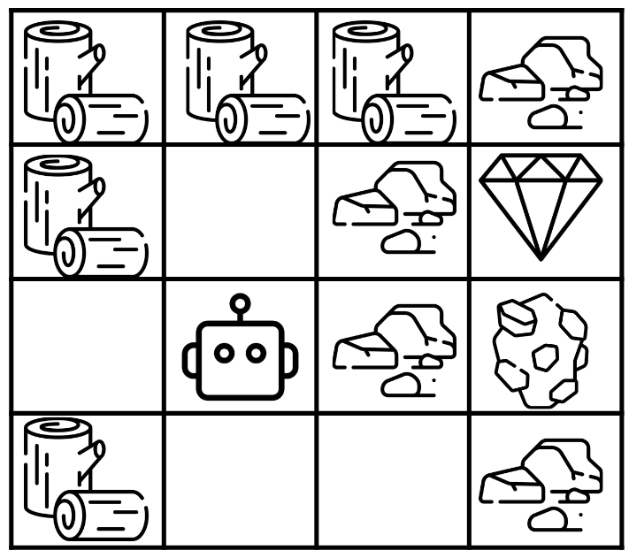

# SimpleCrafter Environment

A 2D gridworld environment.
The environment consists of a range of resources that the agent needs to collect and use
to make tools that allow them to collect more resources.
The goal of the agent is to collect a diamond in as few timesteps as possible.

A more simple and refined version of the [Crafter environment](https://danijar.com/project/crafter/) (Hafner 2021).

| Parameter     | Type                      | Description                                                                                       |
|---------------|---------------------------|---------------------------------------------------------------------------------------------------|
| Map Size: $n$ | $\mathbb{N}$              | Height and width of the map.                                                                      |
| Map           | $\mathbb{N}^{n \times n}$ | Map layout to use. Describes if each square contains wood, stone, iron, diamond, or is empty. |

| Property                | Value | Upper Bound |
|-------------------------|-------|-------------|
| $\vert\mathcal{S}\vert$ | ~     | $7^{n^{2}}$ |
| $\vert\mathcal{A}\vert$ | $9$   | ~           |

| Feature                            | Value |
|------------------------------------|-------|
| Deterministic                      | Yes   |
| Directed                           | No    |
| Continual                          | No    |
| All Actions Possible in all States | Yes   |

## State Space

**Type:** Vector of length $n^{2} + 7$ containing natural numbers.
($\mathbb{N}^{n^{2} + 7}$)

**Upper Bound:** $7^{n^{2}}$

A state is made up of a flattened version of the map, showing the location of the agent
and resources, along with the current tools and resource amounts the agent holds:

| Index                       | Description                                                                                                                                |
|-----------------------------|--------------------------------------------------------------------------------------------------------------------------------------------|
| $\left[0, n^{2} - 1\right]$ | **Map:** For $0 \leq i, j < n$, the value at index $ni + j$ describes what is contained on the grid square at $\left(i, j\right)$. |
| $n^{2}$                     | **Wood:** The amount of wood gathered by the agent.                                                                                        |
| $n^{2} + 1$                 | **Stone:** The amount of stone gathered by the agent.                                                                                      |
| $n^{2} + 2$                 | **Iron:** The amount of iron gathered by the agent.                                                                                        |
| $n^{2} + 3$                 | **Diamond:** The amount of diamond gathered by the agent.                                                                                  |
| $n^{2} + 4$                 | **Wood Pickaxe:** Is $0$ if the agent does not have a wood pickaxe, and $1$ if they do.                                                |
| $n^{2} + 5$                 | **Stone Pickaxe:** Is $0$ if the agent does not have a stone pickaxe, and $1$ if they do.                                              |
| $n^{2} + 6$                 | **Iron Pickaxe:** Is $0$ if the agent does not have an iron pickaxe, and $1$ if they do.                                               |

The possible resources on the map are:

| Value | Resource |
|-------|----------|
| $0$   | Empty    |
| $1$   | Agent    |
| $2$   | Wood     |
| $3$   | Stone    |
| $4$   | Iron     |
| $5$   | Diamond  |
| $6$   | Table    |

## Action Space

**Type:** $\mathbb{N}$

| Action               | Description                                                                                                                                                                                                                                                                |
|----------------------|----------------------------------------------------------------------------------------------------------------------------------------------------------------------------------------------------------------------------------------------------------------------------|
| North: $0$           | Move up one square.                                                                                                                                                                                                                                                        |
| South: $1$           | Move down one square.                                                                                                                                                                                                                                                      |
| East: $2$            | Move right one square.                                                                                                                                                                                                                                                     |
| West: $3$            | Move left one square.                                                                                                                                                                                                                                                      |
| Collect: $4$         | Collect the resources in all squares adjacent to the agent. To collect stone a wood pickaxe is required, to collect iron a stone pickaxe is required, and to collect diamond an iron pickaxe is required. Has no effect if no adjacent resources can be collected. |
| Place Table: $5$     | Remove one gathered wood and place a table in the square directly north of the agent. Requires the square to be empty and the agent to have at least one wood. The action has no effect otherwise.                                                                 |
| Wood Pickaxe: $6$    | Remove one wood to create a wood pickaxe.  Requires at least one wood and to be adjacent to a table, has no effect otherwise.                                                                                                                                          |
| Stone Pickaxe: $7$   | Remove one wood and one stone to create a stone pickaxe.  Requires at least one wood and stone and to be adjacent to a table, has no effect otherwise.                                                                                                                 |
| Iron Pickaxe: $8$    | Remove one wood and one iron to create a stone pickaxe.  Requires at least one wood and iron and to be adjacent to a table, has no effect otherwise.                                                                                                                   |

## Transition Dynamics
The agent starts in random empty grid square in the map.
Each timestep the agent moves, collects resources, or crafts equipment.
The environment terminates when the agent collects a diamond. The environment also terminates
when the total wood gathered and in the map is less than $4$, in this case the agent does not
have enough resources to collect a diamond.

## Reward
Each timestep the agent receives the reward of $-0.01$.

When the agent takes an action with no effect (such as collecting when no resources are available to)
they receive a reward of $-0.5$.

Collecting a diamond gives a reward of $2.0$.

Transitioning to a terminal state where there is $4$ or less total wood in the domain
gives a reward of $-3.0$.
