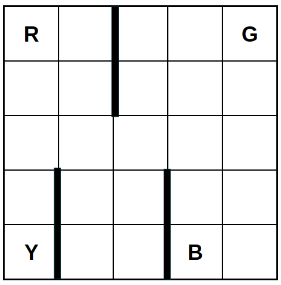

# Modified Taxicab

A 2D gridworld environment based on the classic taxicab domain.
Each timestep there is a chance a passenger appears at one of four stops,
and the agent needs to collect the passenger and take them to the correct destination stop.

| Parameter                | Type                    | Description                                                                                                                               |
|--------------------------|-------------------------|-------------------------------------------------------------------------------------------------------------------------------------------|
| Continual                | Boolean                 | Determines if the environment is a continual problem or not.                                                                              |
| Probability Weights: $p$ | $\left[0, 1\right]^{5}$ | Describes the probability of a passenger appearing at one of the stops or no passenger appearing.  The sum of entries must equal $1$. |

| Property                | Value |
|-------------------------|-------|
| $\vert\mathcal{S}\vert$ | 525   |
| $\vert\mathcal{A}\vert$ | 6     |

| Feature                            | Value  |
|------------------------------------|--------|
| Deterministic                      | No     |
| Directed                           | No     |
| Continual                          | Yes/No |
| All Actions Possible in all States | Yes    |

## State Space
**Type:** Vector of length $4$ containing natural numbers ($\mathbb{N}^{4}$),

**Size:** 525

A state contains the following information at each index:

| Index | Description                                                                                                                                                             |
|-------|-------------------------------------------------------------------------------------------------------------------------------------------------------------------------|
| 0     | **X Coordinate** of the agent, ranges from $0$ - $4$.                                                                                                                   |
| 1     | **Y Coordinate** of the agent, ranges from $0$ - $4$.                                                                                                                   |
| 2     | **Passenger Location**, ranges from $0$ - $3$ for each potential stop.  Is $5$ if in the taxi, and $6$ when there is passenger.                                     |
| 3     | **Passenger Destination**, ranges from $0$ - $3$ for each potential stop.  Is $5$ if the passenger is at their destination,  and $6$ when there is no passenger |

## Action Space

**Type:** $\mathbb{N}$

| Action                 | Description                                                                                                                                                 |
|------------------------|-------------------------------------------------------------------------------------------------------------------------------------------------------------|
| North: $0$             | Move up one square.                                                                                                                                         |
| South: $1$             | Move down one square.                                                                                                                                       |
| East: $2$              | Move right one square.                                                                                                                                      |
| West: $3$              | Move left one square.                                                                                                                                       |
| Pickup Passenger: $4$  | Place the passenger into the taxi, has no effect if there is no passenger at the agent's location.                                                          |
| Putdown Passenger: $5$ | Place the passenger at the current location. Has no effect if there is no passenger in the taxi, or if the agent is not at the passenger's destination. |

## Transition Dynamics

The agent starts in a random square of the grid with no passenger at any stop.
At each timestep there is a chance that a passenger will appear at one of the four stops (Y, R, G, B).
The probability of a passenger appearing at one of the stops is based on the values of $p$:

| Index of $p$ | Stop                   | Default Value |
|--------------|------------------------|---------------|
| $0$          | Y                      | $0.25$        |
| $1$          | R                      | $0.01$        |
| $2$          | G                      | $0.01$        |
| $3$          | B                      | $0.01$        |
| $4$          | No passenger appearing | $0.72$        |

When a passenger has appeared, no other passenger can appear.
The passenger's destination is chosen uniform randomly from one of the four stops.
The agent must navigate to the correct stop, collect the passenger, and place them at their destination.

If environment terminates when the agent takes the passenger to their correct stop.
If the environment is made continual, after the passenger is dropped of they leave the domain and the environment continues with no passenger.
Each timestep a passenger may appear at one of the four stops.

## Reward
When the agent drops of a passenger at their destination, they receive a reward of $2.0$.

When the agent takes an action with no effect (such as trying to collect a passenger when there is none)
the agent receives a reward of $-1.0$.
