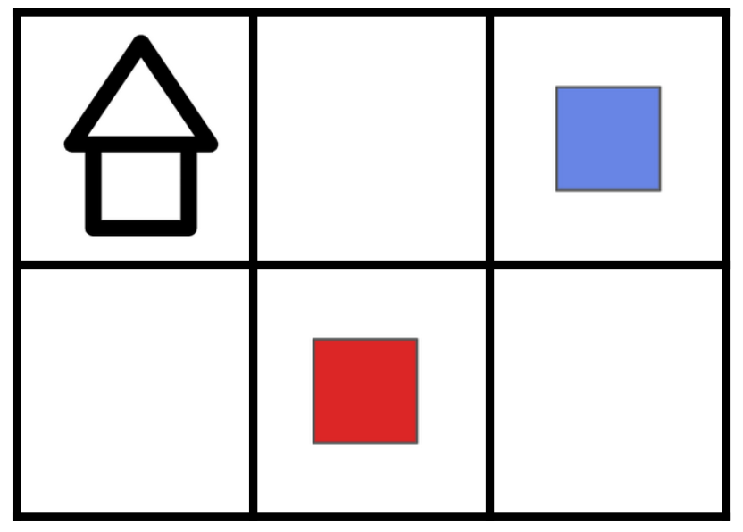
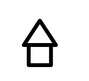
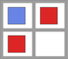
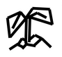
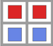

# Tinytown Environment Specification

A discrete environment based on an $n \times m$ grid.
Each timestep the agent places a resource onto an empty grid square.
The environment alternates between a _resource phase_ where the agent places a resource on an empty square,
and a _building phase_ where the agent converts groups of resources into a single building.

Based on the board game [Tiny Towns](https://www.petermcpherson.com/games/tiny-towns) by Peter McPherson.

| Parameter        | Type         | Description              |
|------------------|--------------|--------------------------|
| Grid Height: $n$ | $\mathbb{N}$ | Height of the town grid. |
| Grid Length: $m$ | $\mathbb{N}$ | Length of the town grid. |

| Property                | Value                                             | Upper Bound             |
|-------------------------|---------------------------------------------------|-------------------------|
| $\vert\mathcal{S}\vert$ | ~                                                 | $2\times{{5}^{nm}} - 1$ |
| $\vert\mathcal{A}\vert$ | $2{\left(nm\right)}^{2} + 2{\left(nm\right)} + 1$ | ~                       |

| Feature                            | Value |
|------------------------------------|-------|
| Deterministic                      | Yes   |
| Directed                           | Yes   |
| Continual                          | No    |
| All Actions Possible in all States | No    |

## State Space

**Type:** Matrix of size $\left(n + 1\right) \times \left(m + 1\right)$
containing values from $\left\lbrace0, 1, 2, 3, 4\right\rbrace$.
More formally: ${\left\lbrace0, 1, 2, 3, 4\right\rbrace}^{m + 1 \times n + 1}$.

**Upper bound:** $2\times{{5}^{nm}} - 1$.

A state is a $n + 1 \times m + 1$ matrix where the $\left(i, j\right)$ index shows the
resource or building contained in the $\left(i, j\right)$ square.
The value is $0$ if the grid square is empty. The value at index $\left(n, m\right)$ is $0$
if the state is in the _resource phase_, or $1$ if the state is in the _building phase_.

## Action Space

**Type:** A vector of length $6$ containing natural numbers ($\mathbb{N}^{6}$).

Actions correspond to either placing a specific resource at a grid location,
converting a group of resources centered on a location into a building at another location,
or ending the building phase.

| Action                                              | Description                                                                                                                                                                         | Conditions                                                                                                                                                                                                                                 |
|-----------------------------------------------------|-------------------------------------------------------------------------------------------------------------------------------------------------------------------------------------|--------------------------------------------------------------------------------------------------------------------------------------------------------------------------------------------------------------------------------------------|
| $\left(i, j, 0, \cdot, \cdot, 0\right)$             | Where $i < n$ and $j < m$.  Place a _brick_ at grid square $\left(i, j\right)$.                                                                                                 | The square at $\left(i, j\right)$ must be empty and the state is in the resource phase.                                                                                                                                                |
| $\left(i, j, 1, \cdot, \cdot, 0\right)$             | Where $i < n$ and $j < m$.  Place _glass_ at grid square $\left(i, j\right)$.                                                                                                   | The square at $\left(i, j\right)$ must be empty and the state is in the resource phase.                                                                                                                                                |
| $\left(i, j, 0, \tilde{i}, \tilde{j}, 1\right)$     | Where ${i, \tilde{i} < n}$ and ${j, \tilde{j} < m}$. Use the resource pattern centered at $\left(i, j\right)$ to place a cottage at $\left(\tilde{i}, \tilde{j}\right)$.    | The squares from $\left(i, j\right)$ to $\left(i + 1, j + 1\right)$ contain the cottage resource pattern, ${i - 1 \leq \tilde{i}\leq i + 1}$, $j - 1 \leq \tilde{j}\leq j + 1$, and the state is in the building phase.    |
| $\left(i, j, 1, \tilde{i}, \tilde{j}, 1\right)$     | Where ${i, \tilde{i} < n}$ and ${j, \tilde{j} < m}$. Use the resource pattern centered at $\left(i, j\right)$ to place a greenhouse at $\left(\tilde{i}, \tilde{j}\right)$. | The squares from $\left(i, j\right)$ to $\left(i + 1, j + 1\right)$ contain the greenhouse resource pattern, ${i - 1 \leq \tilde{i}\leq i + 1}$, $j - 1 \leq \tilde{j}\leq j + 1$, and the state is in the building phase. |
| $\left(\cdot, \cdot, \cdot, \cdot, \cdot, 2\right)$ | End the building phase.                                                                                                                                                             | The state must be in the building phase.                                                                                                                                                                                                   |

## Transition Dynamics
In tinytown there are two resource types and two building types. Each building has a corresponding resource pattern.

| Index | Resource | Image                                                                                     |
|-------|----------|-------------------------------------------------------------------------------------------|
| 0     | Brick    |   |
| 1     | Glass    | . |

| Index | Building   | Image                                                                            | Resource Pattern                                                                                 |
|-------|------------|----------------------------------------------------------------------------------|--------------------------------------------------------------------------------------------------|
| 0     | Cottage    |        |        |
| 1     | Greenhouse |  |  |

The environment start state is an entirely empty grid in the resource phase.
During the resource phase, the agent places one resource in an empty grid square. After this, the environment transitions to the building phase.

In the building phase, the agent can place buildings on the grid. If the matching building pattern is on the grid,
the agent can take an action to remove all resources from this pattern and place the corresponding building in one of
the squares of the pattern. The agent can keep taking actions to place buildings (if there are corresponding patterns).
Alternatively, the agent can take the end building phase action to end the building phase and return to the resource phase.

The environment terminates when the agent takes the end building phase action in a state where every square is filled.

## Reward
No reward is given until the agent transitions to a terminal state.
When transitioning to a terminal state, the agent receives a reward of
$3\min{\left\lbrace c, 4g \right\rbrace} - nm + c + g$, 
where $c$ and $g$ are the number of cottages and greenhouses in the terminal state respectively.

This encourages the agent to construct as many buildings as possible,
building a greenhouse for every $4$ cottages.
